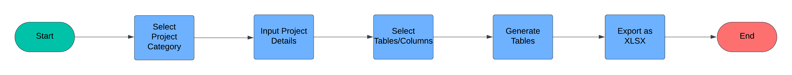
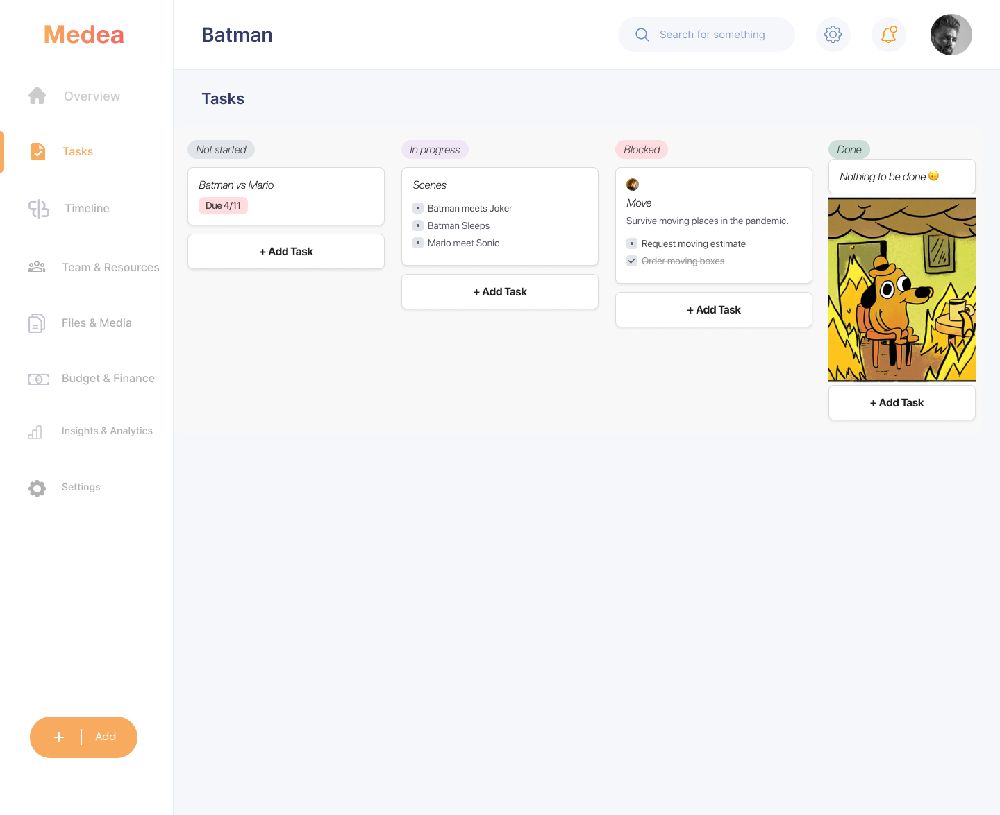
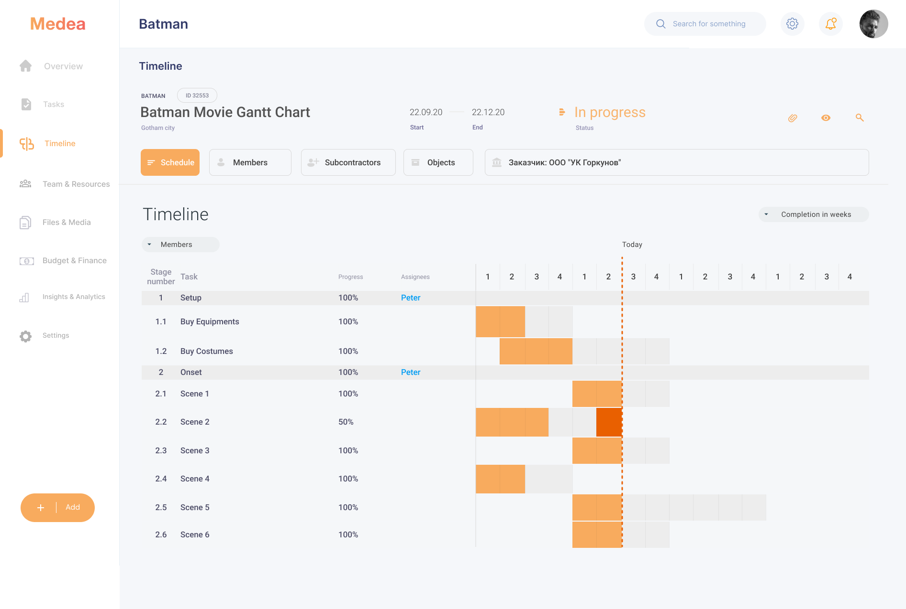
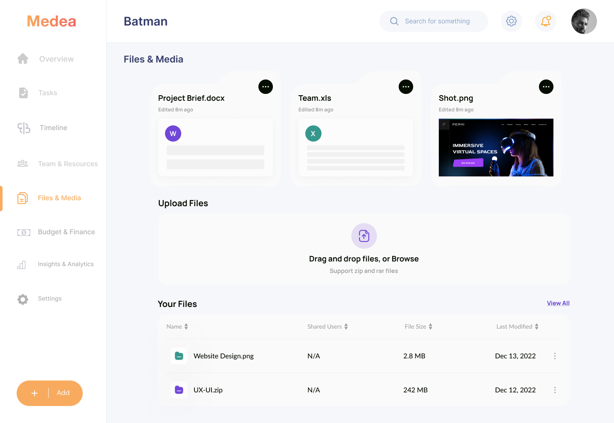
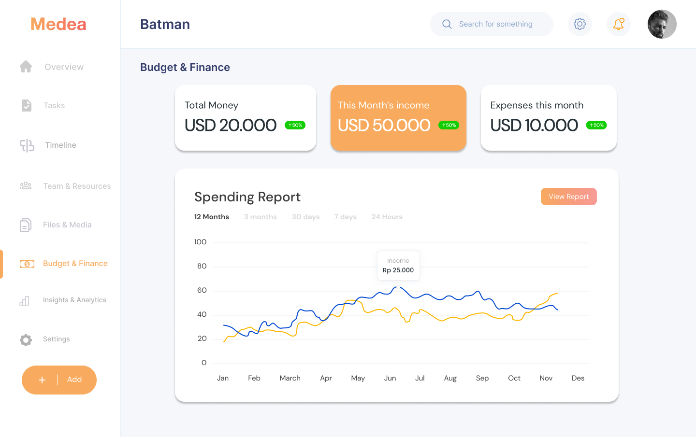
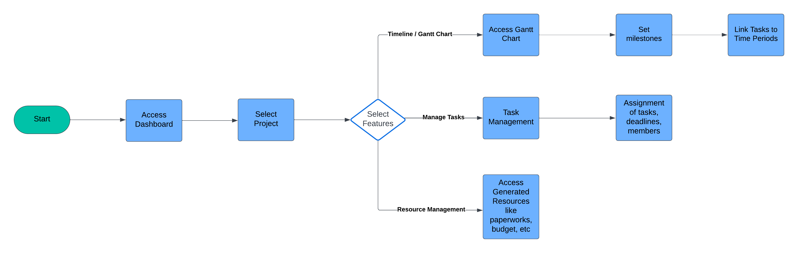
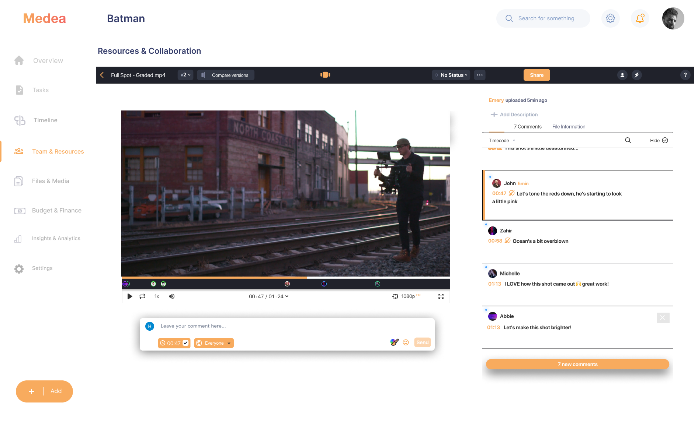
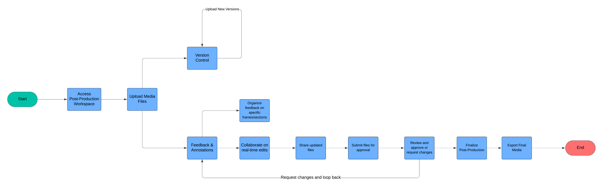

# Medea - The All-in-One Media Production Platform 🎥✨

## Table of Contents 📖

1. [Problem Statement](#problem-statement-)
2. [Key Features](#key-features-)
3. [Rationale](#rationale-)
4. [Local Deployment](#local-deployment-)
5. [Tech Stack](#tech-stack-️)
6. [Our Engineers](#our-engineers-)
7. [Conclusion](#conclusion-)

---

## Problem Statement 💡

In the dynamic media production industry, professionals are hindered by outdated and fragmented tools that slow creativity and lead to inefficiencies. Task management, resource coordination, collaboration, file management, budget tracking, and analytics are often disjointed, resulting in delays and added costs. Medea is designed to streamline these processes by providing an all-in-one platform that merges AI automation with intuitive design to enhance both pre-production and post-production workflows.

---

## Key Features 🚀

- **AI-powered Template Generator**: Automates the creation of tailored templates for media projects like movies, photography, and commercials, ensuring consistency and reducing setup time.
- **Project Management** (Planned): Centralized management of all production tasks, team coordination, scheduling, file handling, budget tracking, and data-driven insights to improve efficiency and reduce miscommunication.
- **Post-production Collaboration** (Planned): Real-time editing, collaboration, and feedback tools with version control to ensure smooth workflows.

---

## Rationale 🎨

Medea addresses the inefficiencies in the media production process, freeing professionals to focus on creativity. By automating administrative and organizational tasks, Medea provides media teams with tools to improve productivity without sacrificing creativity.

---

## Local Deployment 💻

To run Medea locally, follow these steps:

1. Clone the repository:

```
git clone https://github.com/lluciiiia/Medea.git
cd Medea
```

2. Install dependencies:

```
npm install
# or
yarn install
# or
pnpm install
```

3. Create an .env.local file for environment variables:

```
NEXT_PUBLIC_API_URL=<your-api-url>
NEXT_PUBLIC_SUPABASE_URL=<your-supabase-url>
NEXT_PUBLIC_SUPABASE_ANON_KEY=<your-anon-key>
```

4. Run the development server:

```
npm run dev
```

5. Open http://localhost:3000/home with your browser to view the app.

## Tech Stack ⚙️

### Frontend:

- **Framework**: [Next.js](https://nextjs.org) with React and TypeScript
- **Styling**: Tailwind CSS for rapid UI development
- **Font**: Geist font from Vercel

### Backend:

- **Database**: PostgreSQL managed via [Supabase](https://supabase.io)

### AI Integration 🤖:

- **Gemini API**: Pre-trained model, Gemini, for AI-powered template generation
- **Prompt Engineering**: Used to generate custom media templates

---

### 1. **AI-powered Template Generator (MVP) 🧠**

The AI-driven template generator is fully operational and allows users to generate project-specific templates (e.g., movie production, TV commercials) tailored to their needs. This feature integrates a pre-trained Large Language Model (LLM) to deliver suggestions for planning steps, shooting schedules, and other key aspects.

**Architecture**:

- **Frontend**: User inputs data via a form, which includes the project type, desired output, and other variables.
- **Backend**: LLM API call is made to generate the relevant template. The template is customized based on the project type (e.g., movie, photoshoot).
- **Database**: Supabase stores the project data and generated templates for each user.
- **AI Integration**: Prompt engineering allows the LLM to generate detailed steps, resource plans, and timelines for specific media types.

You can find the **flow diagram** for the Template Generator at the following path:

- **Template Generator Flow**: 

---

### 2. **Project Management (Planned) 📋**

The Project Management feature will centralize all production-related tasks, resource allocation, file management, budget tracking, and analytics to enhance collaboration and efficiency.

#### **UI/UXs**:

- **Kanban Board for Tasks**: The task management system is visually displayed in a **Kanban-style board** with sections such as Not Started, In Progress, Blocked, and Done. Tasks can be assigned, updated, and prioritized easily.
- **Gantt Chart for Scheduling**: The timeline (Gantt chart) tracks the progress of each phase of the project, allowing for a detailed breakdown of who is working on what and when resources are scheduled to be used.
- **File Management**: A dedicated area for uploading, organizing, and managing project-related files. The UI allows for drag-and-drop uploads, file sharing, and categorization by file type (e.g., project briefs, images, videos).
- **Budget Management**: Budget tracking tools allow teams to input project budgets and track spending. Financial reports are generated, showing how expenses stack up against budget estimates. The UI presents clear, actionable data.
- **Insights & Analytics**: Data-driven insights are provided through a dashboard, showing trends and performance metrics (e.g., task completion rates, resource utilization). Graphs and charts offer a visual representation of the progress of each project, aiding in strategic decision-making.

Mockups for these features can be viewed:

- **Task Management**: 
- **Gantt Chart**: 
- **File Management**: 
- **Budget Management**: 
- **Insights & Analytics**: 

You can find the **flow diagram** for Project Management at the following path:

- **Project Management Flow**: 

---

### 3. **Post-production Collaboration (Planned) 🎬**

The post-production collaboration feature will allow users to work together in real-time on media projects. The goal is to ensure seamless feedback, version control, and synchronized updates across teams.

#### **UI/UXs**:

Mockup for post-production collaboration can be viewed .

You can find the **flow diagram** for Post-production Collaboration at the following path:

- **Post-production Collaboration Flow**: 

---

## Our Engineers 👩‍🍳👨‍🍳

- **Seokyung Kim <a href="https://github.com/lluciiiia" target="_blank"></a>**
- **Gia Tin Huynh Duc <a href="https://github.com/giatinhuynh" target="_blank"></a>**

## Conclusion 🎉

Medea is more than just a project management tool; it is a transformative platform designed to enhance the creative spirit of media production. By integrating technology into the production process, Medea allows professionals to focus on their craft and brings the media industry into the 21st century.
